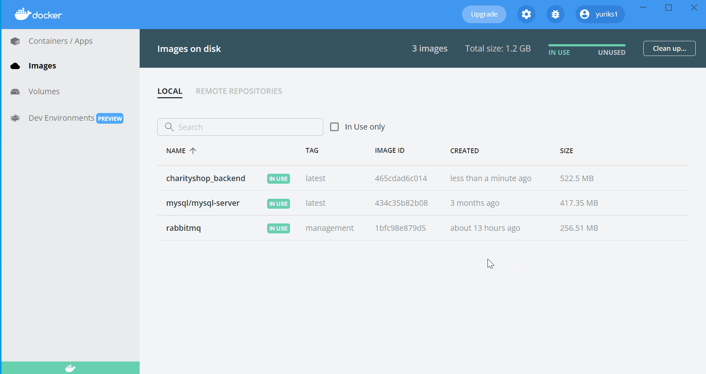

[](https://forthebadge.com)
[](https://github.com/YurMada/CharityShop/actions/workflows/maven.yml)


```
Charity Management Project as a Spring Boot application that manages employees, users, roles,
donations, stocks and charities, stored in a MySQL.
```

##  Deployment :


- Clone the repository
    - Go to your favourite Integrated Development Environment.
    - Type the following: `https://github.com/YurMada/CharityShop.git`


## How to start application :

- Install Docker (can be found here  https://www.docker.com)
- Type the following into your IDE :

```
docker-compose up --build
```


## Accessing Webpage via Docker :




## JSON and Endpoints :


Use **Insomnia** (can be found here https://insomnia.rest/download ) to run the following endpoints :

- Use `Basic Auth`
  - Admin: ADMIN / password2

**POST and PUT requires a Body with a JSON object. PUT requires an ID as well**

### Users:

| CRUD   | Webpage's URL | Action                      |
|--------|---------------|-----------------------------|
| POST   | /users/signup | Creates user                |
| DELETE | /users/{id}   | Deletes user with ID = {id} |
| GET    | /users/{id}   | Returns user with ID = {id} |
| PUT    | /users/{id}   | Updates user with ID = {id} |
| GET    | /users        | Returns all users           |

```json
{
  "username": "<username>",
  "email": "<email>",
  "password": "<password>"
}
```

### Roles:

| CRUD   | Webpage's URL | Action                      |
|--------|---------------|-----------------------------|
| POST   | /roles        | Creates role                |
| DELETE | /roles/{id}   | Deletes role with ID = {id} |
| GET    | /roles/{id}   | Returns role with ID = {id} |
| PUT    | /roles/{id}   | Updates role with ID = {id} |
| GET    | /roles        | Returns all roles           |

```json
{
  "role": "<role>"
}
```

### Employees:

| CRUD   | Webpage's URL   | Action                          |
|--------|-----------------|---------------------------------|
| POST   | /employees      | Creates employees               |
| DELETE | /employees/{id} | Deletes employee with ID = {id} |
| GET    | /employees/{id} | Returns employee with ID = {id} |
| PUT    | /employees/{id} | Updates employee with ID = {id} |
| GET    | /employees      | Returns all employees           |

```json
{
  "username": "<username>",
  "email": "<email>",
  "password": "<password>"
}
```

### Stocks:

| CRUD   | Webpage's URL | Action                       |
|--------|---------------|------------------------------|
| POST   | /stocks       | Creates stock                |
| DELETE | /stocks/{id}  | Deletes stock with ID = {id} |
| GET    | /stocks/{id}  | Returns stock with ID = {id} |
| PUT    | /stocks/{id}  | Updates stock with ID = {id} |
| GET    | /stocks       | Returns all stocks           |

```json
{
  "amount": "<amount>"
}
```

### Donations:

| CRUD   | Webpage's URL   | Action                          |
|--------|-----------------|---------------------------------|
| POST   | /donations      | Creates donation                |
| DELETE | /donations/{id} | Deletes donation with ID = {id} |
| GET    | /donations/{id} | Returns donation with ID = {id} |
| PUT    | /donations/{id} | Updates donation with ID = {id} |
| GET    | /donations      | Returns all donations           |

```json
{
  "amount": "<amount>",
  "name": "<name>"
}
```

### Charities:

| CRUD   | Webpage's URL   | Action                         |
|--------|-----------------|--------------------------------|
| POST   | /charities      | Creates charity                |
| DELETE | /charities/{id} | Deletes charity with ID = {id} |
| GET    | /charities/{id} | Returns charity with ID = {id} |
| PUT    | /charities/{id} | Updates charity with ID = {id} |
| GET    | /donations      | Returns all charities          |

```json
{
  "amount": "<amount>"
}
```

## To access `RabbitMQ` console for managing JMS service:
  - Visit: http://localhost:15672
    - Username : guest
    - Password : guest


 

[](https://forthebadge.com)
